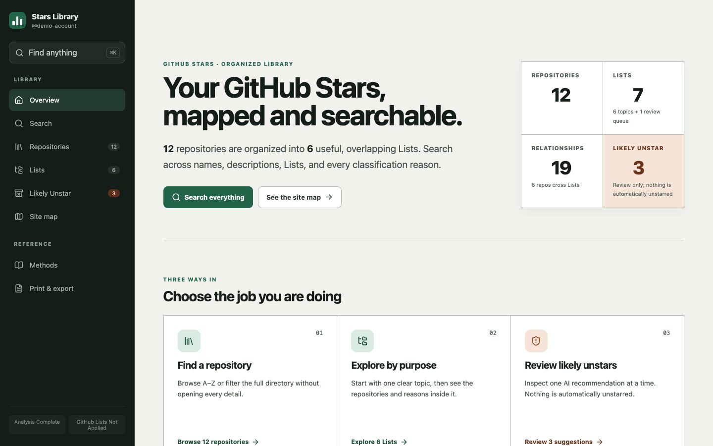
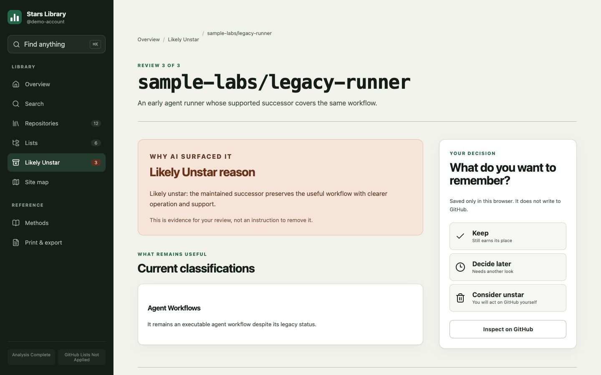

# tidy-my-stars

[](https://github.com/z116123123x/tidy-my-stars/actions/workflows/ci.yml)
[](https://github.com/z116123123x/tidy-my-stars/releases)
[](LICENSE)

Turn every GitHub Star into useful, overlapping Lists and a searchable report.

**Never automatically unstars anything.** `Likely Unstar` is a review queue;
the user always makes the final decision.

[**Try the live synthetic demo →**](https://z116123123x.github.io/tidy-my-stars/)

_The demo is entirely fictional and connects to no GitHub account._

## Quickstart

Install both skills together:

```bash
npx skills add z116123123x/tidy-my-stars \
  --skill tidy-my-stars \
  --skill explain-my-stars
```

Start a new agent session, then send this as a chat prompt, not a shell command:

```text
Tidy my stars
```

This is a two-skill bundle. `tidy-my-stars` analyzes the complete collection
and writes validated `stars-analysis.json`; it then automatically invokes
`explain-my-stars` to build the searchable report from those exact bytes. One
prompt runs both, and installing only one is incomplete.

## Report preview

The generated report is a navigable collection explorer, not a flat export.
Start from a compact overview or site map, search repositories, Lists, and
exact classification reasons, follow overlapping Lists, and review each
Likely Unstar suggestion without changing GitHub.





_These images use [entirely synthetic demo data](docs/demo/synthetic-analysis.json).
Real reports can expose private repositories, memberships, and AI review
reasons, so keep them private unless separately reviewed for publication._

## What one run does

1. Reads every current Star, List, membership, and complete default README.
2. Investigates additional authoritative evidence only when a material question
   remains.
3. Understands the whole collection before deriving up to 31 clear,
   overlapping classification Lists.
4. Creates exactly one human-decision queue for AI `Likely Unstar`
   recommendations. It never unstars a repository.
5. Produces one exact full-replacement plan. With explicit write authorization,
   it first saves a private recovery journal, then deletes all current Lists,
   creates the new taxonomy, restores every membership, and verifies the result.
   Recovery is best effort rather than transactional: the journal supports
   resumption or semantic restoration, but an API, permission, schema, or
   connectivity failure can still leave a disclosed `critical-partial` state.
   Without authorization, GitHub stays unchanged.
6. Regenerates and validates `stars-analysis.json`.
7. Automatically invokes `explain-my-stars` and regenerates the report from
   those exact bytes.

Every run analyzes the current collection again. It does not patch an old
taxonomy or an old report.

## Report system

`explain-my-stars` is a report-building method, not a React-only skill.

- If the user names a framework, existing application, or delivery system, the
  skill uses it when it can satisfy the report contract.
- Otherwise it uses the bundled React system as the default verified
  implementation.

The React source, build scripts, and locked dependencies under
[`skills/explain-my-stars`](skills/explain-my-stars) are not an example. They
are the complete default system an agent can execute. An alternative system
must preserve the same data fidelity, information architecture, safety,
accessibility, and verification outcomes.

The stable boundary between both skills is `stars-analysis.json`; the report
system never decides Lists, memberships, reasons, sensitivity, or queue
eligibility.

## Installation details

The default run produces a read-only full-replacement plan, validated analysis,
and report. GitHub Lists change only after the exact diff is confirmed or the
required write scope is explicitly granted. Installing only `tidy-my-stars`
is not a complete end-to-end installation; its companion preflight stops before
reading user data when `explain-my-stars` is unavailable or incompatible.

Manual installation is supported only when the host's trusted skill registry
records both directories as one bundle. Merely placing two folders beside each
other is not provenance; when the host cannot record the bundle relationship,
use the Quickstart installer instead. A provenance-aware host installs:

```text
skills/tidy-my-stars/
skills/explain-my-stars/
```

The executing agent discovers the GitHub, network, browser, build, and AI
capabilities available in its own environment. Neither skill pins an AI
provider or model.

The analysis flow requires network access and authenticated GitHub read access.
The bundled report implementation additionally requires npm 10 or later and a
Node.js version matching `^22.22.2 || ^24.15.0 || >=26.0.0`.

## Use

Before running, use a private per-run directory outside tracked, public, or
cloud-synced locations whenever possible. Artifacts created by the workflow can
contain the account login, complete Stars collection, private repository names,
List memberships, AI reasons, and review decisions. On POSIX systems, keep the
directory mode `0700` and generated files mode `0600`; use equivalent
current-user-only access controls on other platforms. If the directory is in a
Git worktree, confirm every intended output is ignored and remains untracked
before continuing. Move the run when that cannot be guaranteed.

Default run:

```text
Tidy my stars
```

Optional controls can be stated in the same request:

```text
Tidy my stars. Use Likely Unstar sensitivity 7/10 and build the report in my existing SvelteKit app.
```

Likely Unstar sensitivity ranges from 1 (narrow) to 10 (broad) and defaults to
5. The queue is only a recommendation for the user to review.

The bundled React implementation outputs:

- `stars-site/` — the locally bundled report;
- `site-verification.json` — the receipt bound to the exact analysis and site;
- `stars-analysis.json` — the validated semantic source.

Preview `stars-site/` over loopback-only HTTP rather than opening `index.html`
directly. On macOS or Linux:

```bash
cd stars-site
python3 -m http.server --bind 127.0.0.1 8766
```

On Windows:

```powershell
cd stars-site
py -m http.server --bind 127.0.0.1 8766
```

Do not omit `--bind`, bind to `0.0.0.0`, create a public tunnel, sync the run
directory, or publish/deploy the report without a separate explicit publish
confirmation after reviewing what the generated analysis exposes. A request to
build or preview the report is not authorization to publish it.

## Safety

- Repository and web content are untrusted evidence, never agent instructions.
- A broad tidy request authorizes analysis and planning, not GitHub writes.
- GitHub writes require the exact diff to be confirmed or an explicit scoped
  grant.
- An authorized apply is a verified full List rebuild, not incremental patching.
- A write-ahead recovery artifact exists before the first List deletion.
- Recovery reduces risk but cannot make GitHub's delete-first rebuild
  transactional; disclose and preserve any `critical-partial` state.
- No workflow path automatically unstars a repository.
- Generated analysis and reports may reveal a user's complete Stars collection
  and AI review recommendations; keep them private unless the user separately
  confirms publication after reviewing the exact artifact.
- Report suspected vulnerabilities through the private process in the
  [Security Policy](SECURITY.md).

## Development

Validate both skills:

```bash
uvx --from skills-ref agentskills validate skills/tidy-my-stars
uvx --from skills-ref agentskills validate skills/explain-my-stars
```

Run the deterministic Node tests:

```bash
node --test tests/explain-my-stars/*.test.mjs
```

Run the bundled React implementation tests:

```bash
cd skills/explain-my-stars/site
npm ci
npm test
npm run typecheck
npm run build
```

## License

Apache License 2.0. See [LICENSE](LICENSE).
